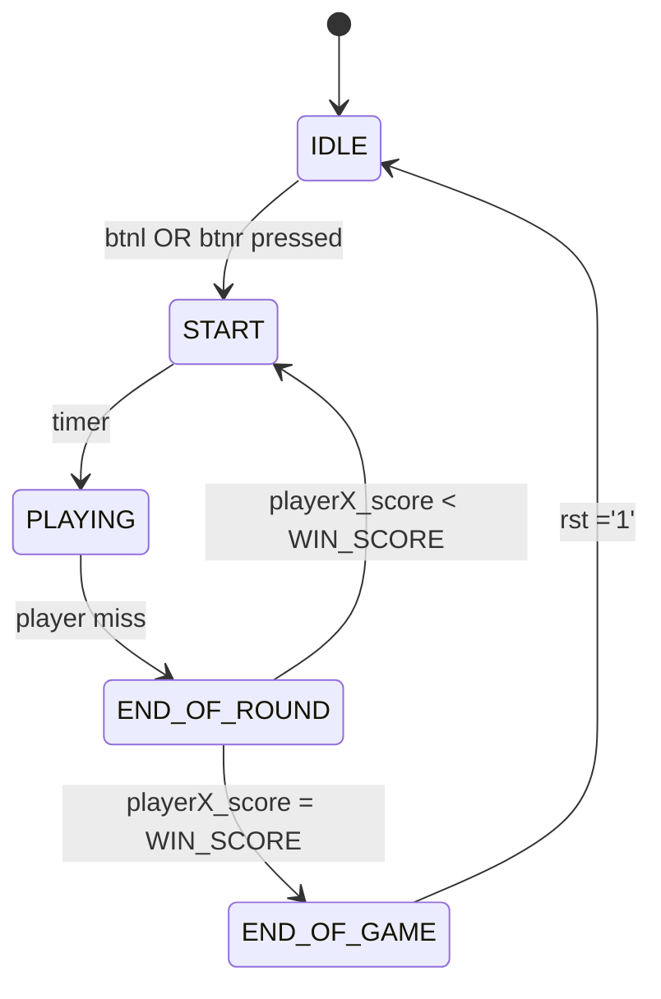

# LED-kový Ping-Pong

Toto je projekt do předmětu BPC-DE1 na fakultě elektrotechniky a komunikačních technologií.

### Na projektu spolupracovali:
- Frank Patrik - programování a struktura programu
- Hromek Matěj
- Križan Damián
- Toman Jan

> [!NOTE]
> Dále to může dodělat někdo jiný (a lépe)

## Struktura programu
Toto je struktura souboru `LED_PingPong_top.vhd`:

Struktura instance **game** komponenty *GameLogic*. *GameLogic* je stavový automat s 5 stavy:

