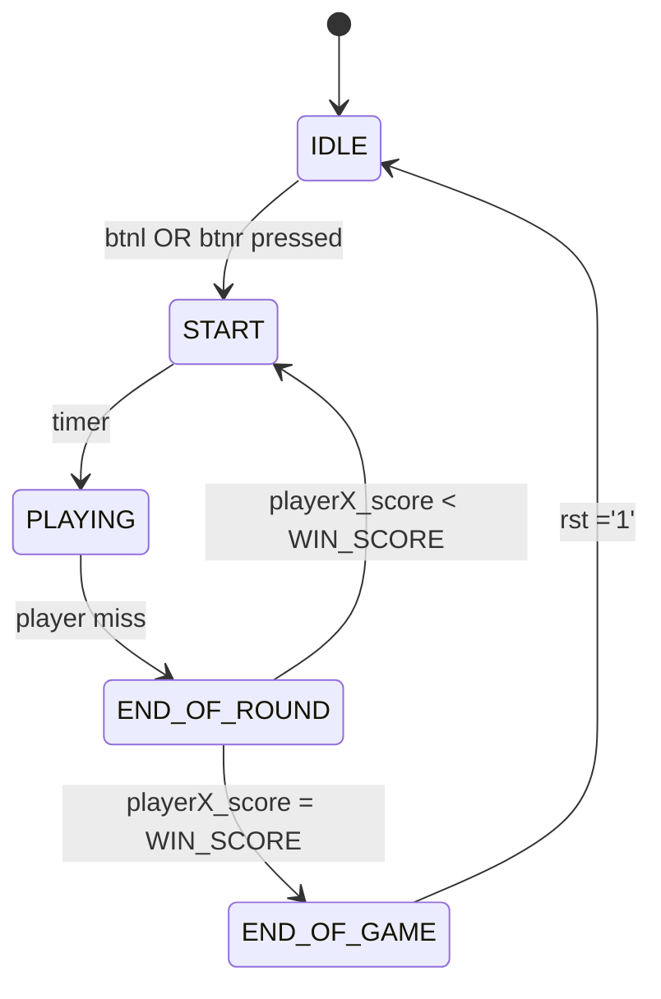

# LED Ping-Pong

Tento projekt je součástí kurzu BPC-DE1 na Fakultě elektrotechniky a komunikačních technologií. Implementuje jednoduchou hru LED Ping-Pong na desce FPGA. Hráči ovládají levou a pravou pálku pomocí tlačítek a hra sleduje skóre. Cílem je jako první dosáhnout stanoveného vítězného počtu bodů.

### Team:
- Frank Patrik - Programming and overall program structure
- Hromek Matěj - Modul časování 
- Križan Damián - 
- Toman Jan -

> [!NOTE]
> Dále to může dodělat někdo jiný (a lépe)

## Program structure
The top-level VHDL file is `LED_PingPong_top.vhd`:

The game instance uses the GameLogic component. GameLogic is a finite state machine (FSM) with 5 states:

### States:
- IDLE – Waiting for the game to start
- START – Initialize round, wait for timer
- PLAYING – Active gameplay
- END_OF_ROUND – Round ends, check if someone missed
- END_OF_GAME – Player reached winning score, wait for reset
