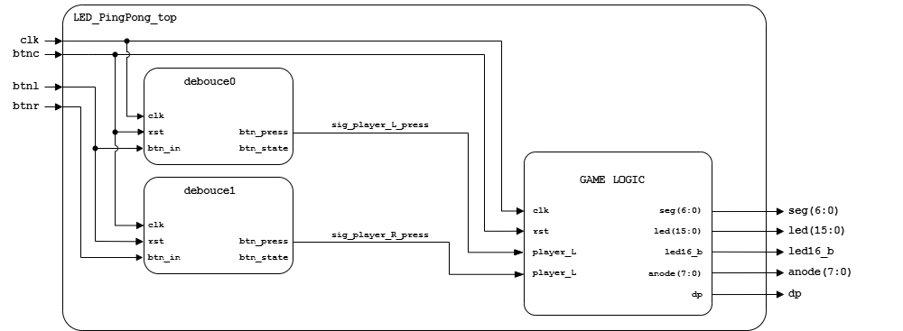
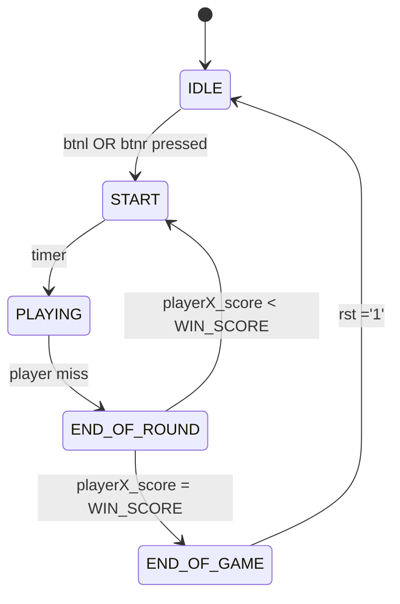

# LED-kový Ping-Pong

This is a project for the BPC-DE1 course at the Faculty of Electrical Engineering and Communication Technologies.

### Na projektu spolupracovali:
- Frank Patrik - Programming and overall program structure
- Hromek Matěj - 
- Križan Damián - 
- Toman Jan -

> [!NOTE]
> Dále to může dodělat někdo jiný (a lépe)

## Struktura programu
The top-level VHDL file is `LED_PingPong_top.vhd`:

The game instance **game** komponenty *GameLogic*. *GameLogic* is a finite state machine (FSM) with 5 states:

