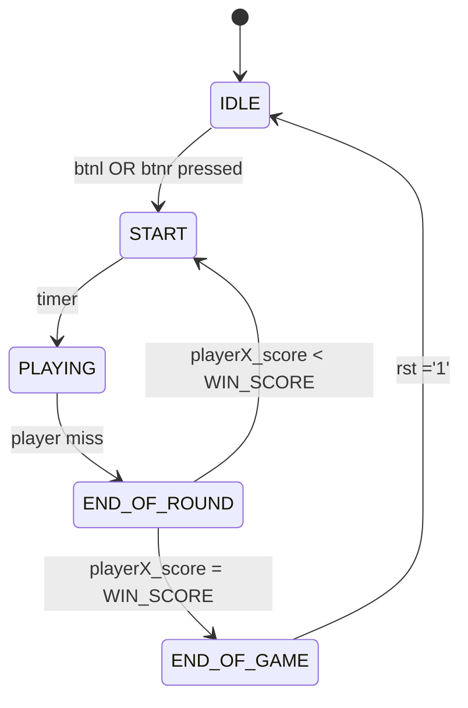

# LED Ping-Pong

This project is part of the BPC-DE1 course at the Faculty of Electrical Engineering and Communication Technologies. It implements a simple LED Ping-Pong game on an FPGA board. Players control left and right paddles using buttons, and the game keeps track of scores. The goal is to reach the defined winning score first.

### Team:
- Frank Patrik - Programming and overall program structure
- Hromek Matěj - Timing module and higher difficulty settings 
- Križan Damián - Implementation and documentation
- Toman Jan -

## Inputs and outputs of the program
### Inputs:
- `btnl`: button for the left player to strike the ball,
- `btnr`: button for the right player to strike the ball,
- `btnc`: button for reseting the game/programe.
### Outputs:
- `7-segment display`: segmented display to show the score of player and to start or announce the winner,
- `led1-16`: leds making up the playing field,
- `led16_b`: this led will flash if the player in the direction of the ball movement, misses.

## Program structure
The top-level VHDL file is `LED_PingPong_top.vhd`:

The game instance uses the GameLogic component. GameLogic is a finite state machine (FSM) with 5 states:

### States:
- IDLE – Waiting for the game to start
- START – Initialize round, wait for timer
- PLAYING – Active gameplay
- END_OF_ROUND – Round ends, check if someone missed
- END_OF_GAME – Player reached winning score, wait for reset

## Weekly status report:
- WEEK 1:  role assignment, basic program structure and top level design

