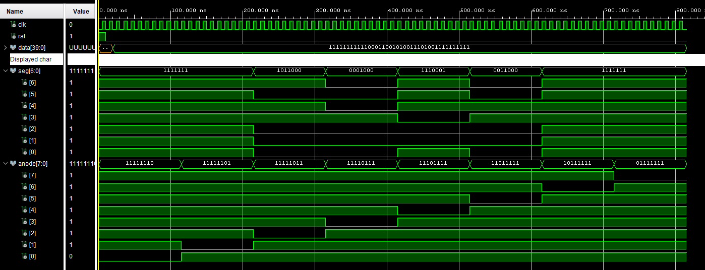
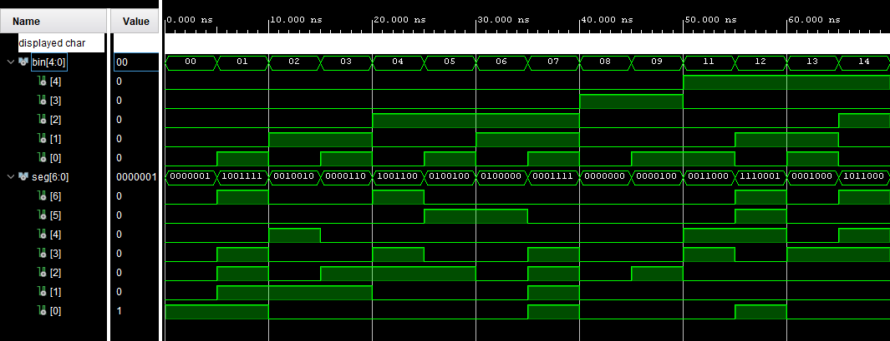
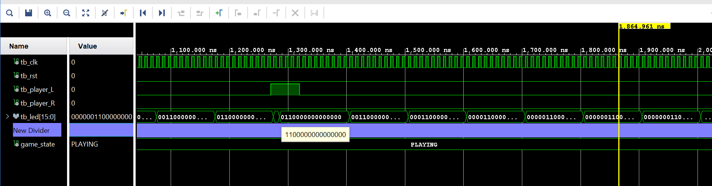
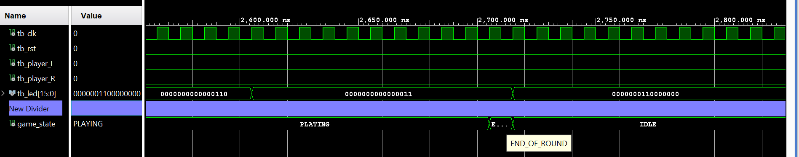

## 1. 7-Segment Display Multiplexing

### Description

The first simulation demonstrates the behavior of the 7-segment display controller using time-division multiplexing. The display is controlled via a shared segment bus (`seg[6:0]`) and individual anode signals (`anode[7:0]`).

[Display driver](https://github.com/270931/DE1-Projekt/blob/main/LED-PingPong/LED-PingPong.srcs/sources_1/new/display_driver.vhd)


### Simulation Waveform



*Figure 1: Time-multiplexed control of the 7-segment display. Each anode is activated sequentially while segment data is updated accordingly.*

### Behavior Analysis

- The `anode` signal cycles through digits sequentially:

  11111110 → 11111101 → 11111011 → 11110111 → ...

- At each time step, only one digit is active (active-low logic).
- The `seg` output changes according to the active digit.

### Conclusion

The simulation confirms correct multiplexing behavior and proper synchronization between `seg` and `anode` signals.

---

## 2. Binary to 7-Segment Decoder (bin2seg)

### Description

This simulation verifies the functionality of the `bin2seg` module, which converts a binary value into a 7-segment representation.

[Bin2seg](https://github.com/270931/DE1-Projekt/blob/main/LED-PingPong/LED-PingPong.srcs/sources_1/new/bin2seg.vhd)

### Simulation Waveform



*Figure 2: Output response of the `bin2seg` decoder for sequential binary inputs.*

### Behavior Analysis

- The input `bin` increments from:

  00 → 01 → 02 → ... → 14

- The output `seg` updates immediately, confirming combinational logic behavior.
- Each value is correctly mapped to its corresponding 7-segment encoding.
  

>[!NOTE]
>The segment mapping uses reversed bit ordering, where seg(6) corresponds to segment 'g' and seg(0) to segment 'a'

### Conclusion

The `bin2seg` module correctly implements binary-to-7-segment decoding and is suitable for displaying numerical values.

## 3. GameLogic Simulation

This section presents simulation results of the `GameLogic` module based on observed waveforms. The module implements a finite state machine controlling the gameplay and LED behavior.

---

### 3.1 Start Condition
[Start](https://tinyurl.com/3bsebdry)
### Behavior Analysis

- The system is initially in the `IDLE` state.
- A transition to the `PLAYING` state occurs after initialization.
- The ball is initialized in the center of the LED vector:

  0000000110000000
  
- Player input is required for this transition in the current implementation.

### Conclusion

The system correctly initializes the game and transitions into active gameplay.

---

### 3.2 Successful Hit
[Hit](https://tinyurl.com/3bsebdry)
### Simulation Waveform



*Figure 4: Ball movement during PLAYING state with continuous progression across LEDs.*

### Behavior Analysis

- The system remains in the `PLAYING` state.
- The LED vector (`led[15:0]`) shows movement of the ball:
- The active bit shifts across the vector
- Example progression:
  ```
  0000001100000000 → 0000011000000000 → 0000110000000000 → ...
  ```
- A player input (`tb_player_L`) is detected during gameplay.
- The ball continues moving, indicating a valid interaction (hit).

### Conclusion

The simulation confirms correct ball movement and proper handling of player input during active gameplay.

---

### 3.3 Missed Hit
[Miss](https://tinyurl.com/3bsebdry)
### Simulation Waveform



*Figure 5: Transition from PLAYING to END_OF_ROUND due to missed hit.*

### Behavior Analysis

- The system is initially in the `PLAYING` state.
- The ball reaches the edge of the LED vector:

  0000000000000011

- No player input is detected (`tb_player_L = 0`, `tb_player_R = 0`).
- The system evaluates this as a missed hit:
- State transitions to `END_OF_ROUND`
- Subsequently transitions back to `IDLE`

### Key Observation

- The state transition sequence is visible:

  PLAYING → END_OF_ROUND → IDLE


### Conclusion

The simulation confirms correct detection of missed events and proper state transitions.

---

## Summary

The GameLogic simulations demonstrate:

- Correct initialization of the game
- Continuous ball movement using LED shifting
- Proper response to player inputs
- Correct state transitions in case of missed hits

The FSM implementation behaves as expected in all tested scenarios.
